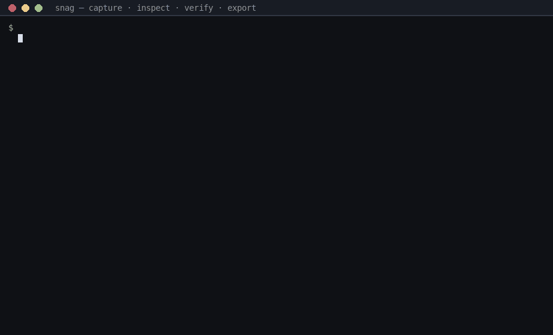

# Five-minute demo

A terminal walkthrough of the core workflow — capture, inspect, verify, and
export — in under fifteen seconds of actual commands.

## Watch



The demo runs the exact sequence below in an isolated environment (fresh
store, temp git repository). Status marks (`OK`/`!`/`X`) are ASCII
substitutions in the GIF renderer; the real tool prints them as colored
glyphs in a terminal.

## The sequence

1. **Agent hits an unrelated bug** — one command, evidence attached:

   ```bash
   snag report "build reports success but produces no artifact" \
     --kind bug \
     --observed "command exited 0; dist/app does not exist" \
     --expected "successful build creates dist/app" \
     --repro "run make release in a fresh clone"
   ```

2. **Continues its task** — capture is one command; nothing else changes.

3. **Another worktree inspects the store:**

   ```bash
   snag list
   snag show <observation-id>
   ```

   `show` reveals the immutable payload plus the auto-attached context:
   repository/checkout/worktree IDs, branch, HEAD, and the executing
   environment.

4. **Integrity is provable:**

   ```bash
   snag verify --full
   ```

5. **The observation is portable:**

   ```bash
   snag export --output observations.jsonl
   ```

   The stream starts with a versioned header and one hash-chained record per
   line — deterministic, diffable, checkpointable by any downstream consumer
   (see [examples/export-consumer/](../examples/export-consumer/)).

6. **No guessing about where data lives:**

   ```bash
   snag doctor
   ```

   Prints the database, objects, and backups paths, the effective context
   source, and the version.

## Run it yourself

```bash
curl -fsSL https://raw.githubusercontent.com/GauravAlbal/snag/master/install.sh | bash
cd "$(mktemp -d)" && git init -q && snag report "try me" && snag list && snag verify --full
```

## The reliability story (not in the demo)

The demo leads with the workflow on purpose — but the durability is the point
of the tool: records are hash-chained and append-only, writes are crash-safe,
`retract` never deletes, and `backup` → `restore` → `rebuild` recovers a store
from a verified point-in-time bundle or an export stream even after data loss.
See [docs/RUNBOOK.md](RUNBOOK.md) for the recovery chain and
[docs/CASE_STUDY.md](CASE_STUDY.md) for the dogfood run that produced the
corpus shown in this release.
