# The observation pipeline

Why Snag exists before a task tracker — and why the two are complementary.

## Why not just use a task tracker?

Task trackers such as Beads and similar dependency-aware execution systems are
excellent once you already know what work should exist. They help agents claim
work, manage dependencies, coordinate execution, and close verified tasks.

But the feedback from live agent use pointed to a different bottleneck:

> The hard part was not tracking accepted work. The hard part was turning a
> flood of raw observations into the few things that actually deserved to
> become work.

That is the distinction. A tracker starts from a **task**. Our problem starts
earlier, with a much noisier primitive: an **observation**.

Agents encounter many small failures, surprises, workarounds, and environmental
oddities while doing unrelated work. Most are too fine-grained, duplicated,
uncertain, or premature to become first-class tasks immediately. If you push
them all straight into a task tracker, you get noise inflation:

- repeated symptoms become separate tasks;
- low-signal papercuts bury structural problems;
- environmental artifacts look like product defects;
- the system fills with work candidates that have not yet earned the cost of
  execution.

So the pipeline is:

```mermaid
flowchart LR
    A[Agent or human encounters friction] --> B[Observation captured in Snag]
    B --> C[Observations accumulate across sessions, repos, and agents]
    C --> D[Coalescing / clustering]
    D --> E[Ranked findings]
    E --> F[Execution candidates]
    F --> G[Task tracker / execution system]
    G --> H[Agent fixes]
    H --> I[Verification / acceptance]
    I --> J[Feedback linked back to finding]
```

## The model

### 1. Observation

The unit at the edge is an **observation**: "this happened, under these
conditions, with this evidence."

Observations are intentionally cheap to record and high-volume by design. They
preserve evidence before it disappears, but they are not yet claims about what
the true underlying problem is, how important it is, or whether it deserves a
task.

### 2. Coalescing

Many observations are manifestations of the same underlying problem. A good
findings system groups near-duplicates and related symptoms into a smaller set
of candidate problems. This is the stage where "the test flaked," "the session
expired," and "the API timed out" may turn out to be one structural issue
rather than three unrelated bugs.

Agent feedback strongly supported this: several apparently separate failures
only became legible once multiple observations were considered together.

### 3. Ranking

After coalescing, we still do not want to execute everything. Clusters need to
be ranked by properties such as:

- frequency;
- severity / blast radius;
- recency;
- cross-repo recurrence;
- fixability;
- whether they block core workflows;
- whether they already have a known workaround.

This is the point where the system goes from "what happened?" to "what matters
next?"

### 4. Execution candidate

Only after clustering and ranking do we create a real **execution candidate**.
At this point the work has earned a slot in a task tracker, because it is no
longer just a raw symptom. It is a scoped candidate for repair, with evidence,
supporting observations, and a reason it deserves attention now.

That is where task trackers shine.

## Why not skip straight to the tracker?

Because trackers are optimized for **managing work**, not for **distilling
noisy evidence into work**. A task tracker assumes that the thing it is
tracking is already:

- distinct enough to deserve its own item;
- important enough to compete for execution;
- stable enough to describe;
- actionable enough to assign.

But agent-generated feedback violates those assumptions. It is abundant,
overlapping, partially wrong, and often too early.

So the systems are complementary:

| Layer | Purpose | Unit |
|---|---|---|
| Snag | Preserve raw encountered evidence | Observation |
| Findings / coalescing layer | Collapse noise into candidate problems | Cluster / finding |
| Task tracker / execution system | Execute and verify chosen work | Task / execution item |

In other words:

> Beads-like systems answer: **How do we manage the work we already chose?**
> Snag and the findings layer answer: **How do we decide what work is worth
> choosing at all?**

## Takeaway

The lesson from agent feedback was not "we need a better task tracker." It was:

> We need a stage before the task tracker that turns high-volume observations
> into a small number of ranked execution candidates.

That is the job of the observation pipeline. Snag is the first stage: it
preserves the observations durably and lets the findings layer (which Snag
deliberately does not contain) do the rest.

See also: [the dogfood case study](CASE_STUDY.md) for the live-agent feedback
that grounded this model.
